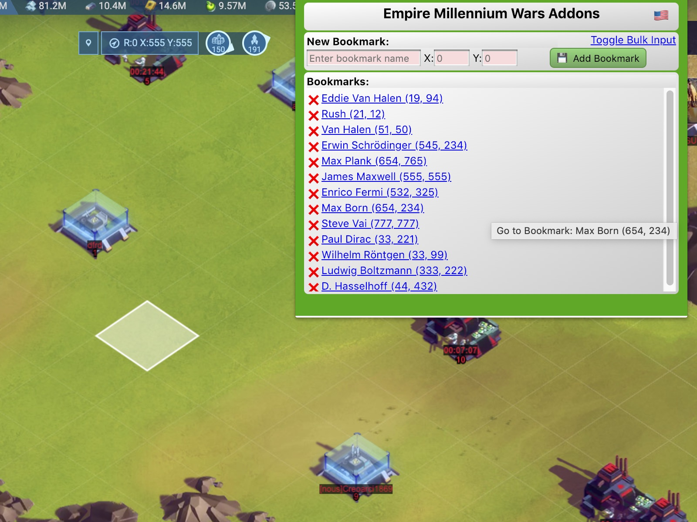

# EmpireMillenniumChromeExt



A Chrome Extension for the game Empire Millennium wars to block specific user's chat messages.

**To Install:**<br>
Download all of the files retaining directory structure.  You can [download the files as a zip archive by clicking here](https://github.com/sflanders95/EmpireMillenniumChromeExt/archive/master.zip) or use git to make a local clone:
```sh
git clone https://github.com/sflanders95/EmpireMillenniumChromeExt
```

Open Chrome and navigate to: [chrome://extensions](chrome://extensions)

Turn Developer mode on: &nbsp; 

Click the "Load Unpacked" button and select the directory where the manifest.json file is that you just downloaded.  *(if you downloaded the zip file, unzip it so chrome can get to the manifest.json file.)*

Now open the [Empire Millennium Wars Game](https://empiremillenniumwars.com/ 'a goodgamesstudios crappy product').

After installing the plugin, a new icon  should have been created at the top right of the chrome window.  The Hover text over the icon will say "Empire Millennium Wars Bookmarks".  Click it to open the main window.  You can start saving bookmarks immediately.  Clicking the add bookmark button will add the new item to the list.  If an error occurs, the bottom of the window will show a message of what happened.  *Note: To update the extension, you can either click on the extensions "remove" button and start over, or unzip the new version into the same spot and click the circular Arrow to refresh.*

If your alliance has a master bookmark file, you can load it by clicking the "Toggle Bulk Input" link near the top.  Paste the text and click save.  This page is finicky and the text must be very precise as this text must be parsed.

What to expect.  You will run into instances where clicking on a bookmark results in "Unknown Object".  Unfortunately I see this a lot.  Refreshing the game seems to remedy all issues I've found with this extension, even the chat logging feature.

If any map artifacts occur in the game, it is the game itself.  Refreshing with F5 is a common necessity for this game, but the bookmarks will remain persistent. 

### Version History:
Jan 20, 2019 - Added export of chat to a new html file for easy download and sharing.  Issue with saving the file: User must choose "Save __A__s" and then choose "Webpage Complete" in order for dynamic html to be saved.  Otherwise the blank template html file is saved and not the desired chat html.

Jan 14, 2019 - Ver 1.01 Allowed new game's domain to permissions of allowable domains. (empireww3.com)

Jan 12, 2019 - Removed chat blocking aspect of the code.  Replaced it with a way to use bookmarks in-game.

Oct 18, 2018 - Changed to allow for new URL for the game.  empiremillenniumwars.ggs-emw.com has been chanegd to game.empiremillenniumwars.com.  Possibly to allow for cross iframe javascript now that the site utilizes one domain "empiremillenniumwars.com".

Oct 14, 2018 - Fixed isseu #2.  realized that removing chat array item in alliance or global also removed corresponding array item in the other chat win.  Changed so it only minimizes the offending text.

Sept 30, 2018 - Revised to allow for new iframe structure of the game.

Sept 26, 2018 - Epoch

---
[MIT Software License](https://raw.githubusercontent.com/sflanders95/EmpireMillenniumChromeExt/master/LICENSE) <br>
\<EOF\>
