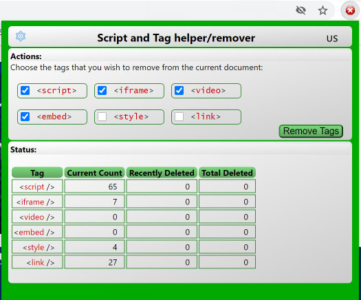

# RemoveScriptsChromeExt



A Chrome Extension to remove annoyances on a web page.

**To Install:**<br>
**Easiest way** Download the [latest release here][Latest]<br>
**...Or** Download all of the [source files here][Master]<br>
**...Or** use git to make a local clone:
```sh
git clone https://github.com/sflanders95/RemoveScriptsChromeExt
```

Open Chrome and navigate to: [chrome://extensions](chrome://extensions)

Turn Developer mode on: &nbsp; 

Click the "Load Unpacked" button and select the directory where the manifest.json file is that you just downloaded.  *(if you downloaded the zip file, unzip it so chrome can get to the manifest.json file.)*

After installing the plugin, a new icon  should have been created at the top right of the chrome window.  The Hover text over the icon will say "Remove Tags From Html".  Click it to open the main window.  Check the boxes for the tags you wish to remove from the current page.  Clicking the "Remove" button will attempt to remove all tags with that name.

### Version History:

- Sep 10, 2019 - Epoch
- Apr 1, 2021 uploaded to github

---

[MIT Software License](https://raw.githubusercontent.com/sflanders95/EmpireMillenniumChromeExt/master/LICENSE) <br>
\<EOF\>

[Latest]: https://github.com/sflanders95/RemoveScriptsChromeExt/releases/latest
[Master]: https://github.com/sflanders95/RemoveScriptsChromeExt/archive/master.zip
